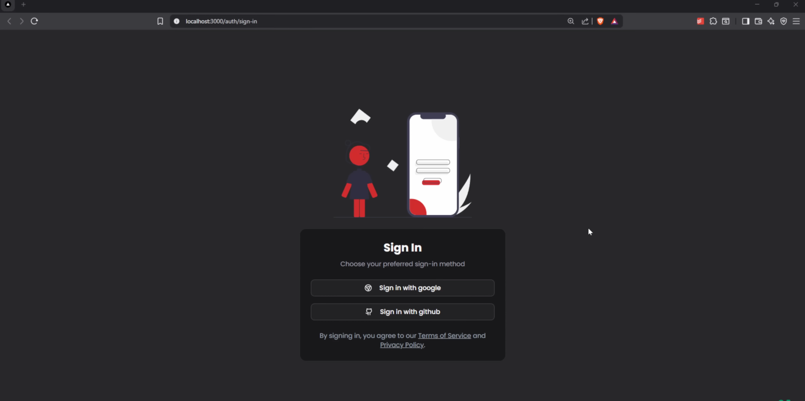
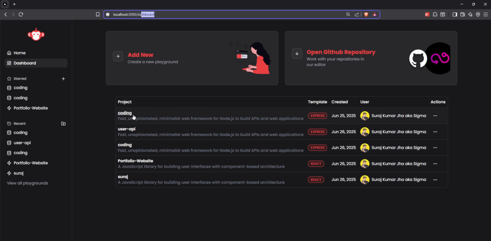
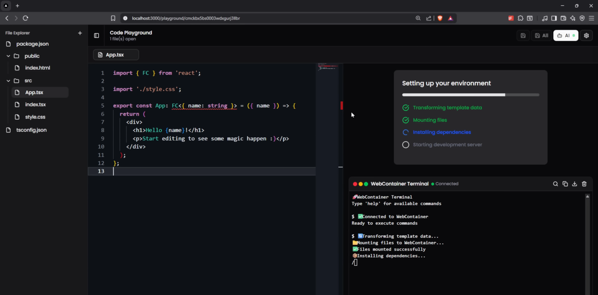
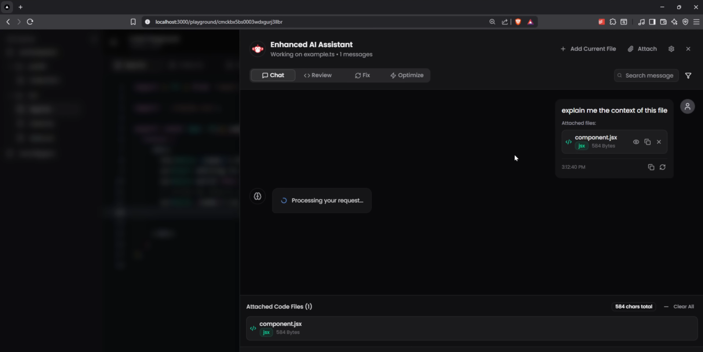

# Cloud Code Studio

A powerful cloud-based integrated development environment (IDE) that allows developers to create, edit, and manage projects in isolated containers with real-time collaboration features.

## Features

### Project Management

Create and manage multiple projects with isolated environments using Docker containers.

### Real-time Code Editor

Built-in Monaco Editor for syntax highlighting, IntelliSense, and seamless code editing experience.

### File System Navigation

Interactive file tree structure with context menus for efficient file and folder management.

### Integrated Terminal

Embedded XTerm terminal with full shell access within your browser.

### Real-time Collaboration

Socket.io-powered real-time synchronization for collaborative coding sessions.

### Container Management

Automatic container creation and management for each project with Docker integration.

### Live File Watching

Real-time file system monitoring with automatic updates across connected clients.

## Tech Stack

### Backend
- **Node.js** - Runtime environment
- **Express.js** - Web framework
- **Socket.io** - Real-time communication
- **Dockerode** - Docker API integration
- **Chokidar** - File system watching
- **UUID4** - Unique identifier generation

### Frontend
- **React** - UI framework
- **Vite** - Build tool and dev server
- **Monaco Editor** - Code editor component
- **XTerm** - Terminal emulator
- **Ant Design** - UI component library
- **Zustand** - State management
- **React Query** - Data fetching and caching
- **Socket.io Client** - Real-time communication

## Installation

### Prerequisites
- Node.js (v16 or higher)
- Docker
- npm or yarn

### Backend Setup
```bash
cd backend
npm install
```

### Frontend Setup
```bash
cd frontend
npm install
```

## Usage

### Development
1. Start the backend server:
```bash
cd backend
npm run dev
```

2. Start the frontend development server:
```bash
cd frontend
npm run dev
```

3. Open your browser and navigate to `http://localhost:5173`

### Production Build
```bash
cd frontend
npm run build
npm run preview
```

## API Documentation

### REST Endpoints
- `GET /api/ping` - Health check endpoint
- `POST /api/projects` - Create a new project
- `GET /api/projects/:id/tree` - Get project file tree

### Socket Events
- **Editor Namespace** (`/editor`)
  - `file:change` - File content updates
  - `file:create` - New file creation
  - `file:delete` - File deletion
  - `folder:create` - New folder creation
  - `folder:delete` - Folder deletion

## Project Structure

```
Cloud-Code-Studio/
├── backend/
│   ├── src/
│   │   ├── config/
│   │   ├── containers/
│   │   ├── controllers/
│   │   ├── routes/
│   │   ├── service/
│   │   ├── socketHandlers/
│   │   └── utils/
│   ├── Dockerfile
│   └── package.json
├── frontend/
│   ├── public/
│   ├── src/
│   │   ├── components/
│   │   ├── pages/
│   │   ├── store/
│   │   └── utils/
│   ├── vite.config.js
│   └── package.json
└── README.md
```

## Contributing

1. Fork the repository
2. Create a feature branch (`git checkout -b feature/amazing-feature`)
3. Commit your changes (`git commit -m 'Add some amazing feature'`)
4. Push to the branch (`git push origin feature/amazing-feature`)
5. Open a Pull Request

## License

This project is licensed under the ISC License.

## Author

[shekokarmahesh](https://github.com/shekokarmahesh)